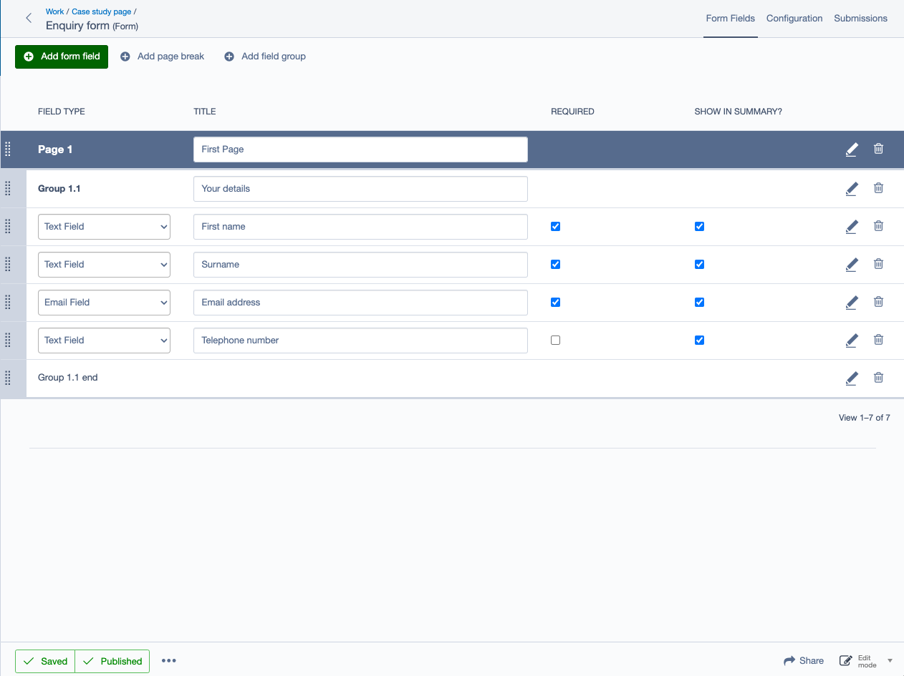
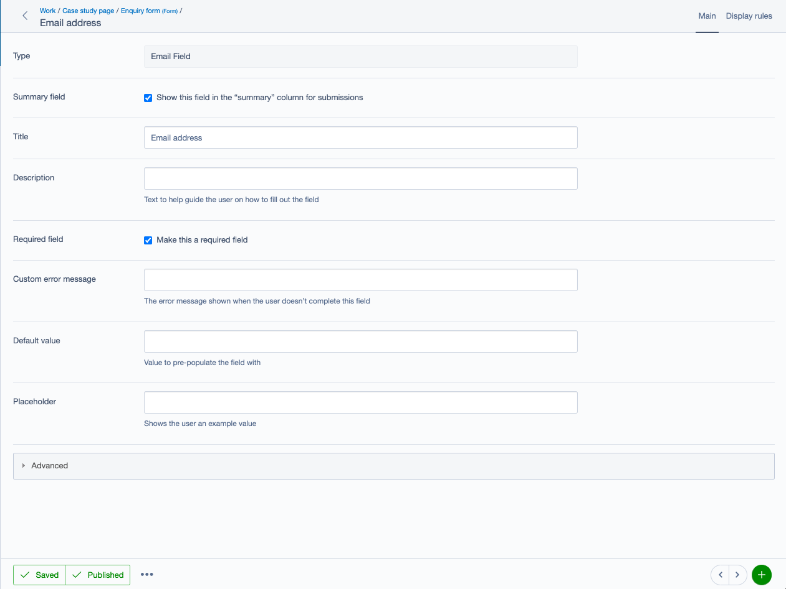

# Silverstripe UserForms Tidying

Opinionated changes to the userforms module by Bigfork.

```bash
composer install bigfork/silverstripe-userforms-tidying
```

## Changes

Changes include, but aren’t limited to:

- Optionally forces userforms via an elemental block - so `UserDefinedForm` pages can't be created in the CMS
- Removes a few fields that confuse content authors
- Moves/replaces/amends other fields to make them more user-friendly
- Makes the Add Field/Add Page/Add Field Group functionality work with add-new-inline to prevent triggering a reload
  when adding to the form
- Adds "required" and "show in summary" as inline-editable fields
- Moves content fields for the userform block into the "configuration" tab, as they're edited less often
- Removes history tab from the userform block, as it's effectively useless
- Makes submissions easier to search by adding min/max date filters
- Includes a set of templates with BEM(ish) CSS classes

## Configuration

If possible, you should disable the UserForms CSS and bundle your own styles in your theme’s CSS. This does require a
decent amount of testing for things like multiple pages (if they’re enabled) to ensure no styles are missing, so use
your own judgement on whether it's worth it. If multiple page forms are _not_ enabled, you should definitely block the
default CSS.

### Force userforms to be created via blocks (recommended)

If blocks are enabled, there’s not really much point having the ability to create userform pages - they have the same
functionality as a page with a userform block, just less flexibility.

```yml
SilverStripe\UserForms\Model\UserDefinedForm:
  extensions:
    - Bigfork\SilverstripeUserFormsTidying\Extensions\UserDefinedFormExtension
```

### Disable multi-page forms (recommended)

As we only really use the UserForms CSS/JS for multi-page forms, it's recommended to block them if not using multi-page
forms.

```yml
DNADesign\ElementalUserForms\Model\ElementForm:
  block_default_userforms_css: true
  block_default_userforms_js: true
  disable_multi_step_forms: true
```

### Disable form field groups

```yml
DNADesign\ElementalUserForms\Model\ElementForm:
  disable_form_field_groups: true
```

### Re-enable disabled field types

The following field types are hidden from CMS users. If they are needed, they can be re-enabled by adding any of the
following to your config.

```yml
---
After: '#userforms-tidying'
---
SilverStripe\UserForms\Model\EditableFormField\EditableCountryDropdownField:
    hidden: false
SilverStripe\UserForms\Model\EditableFormField\EditableFileField:
    hidden: false
SilverStripe\UserForms\Model\EditableFormField\EditableMemberListField:
    hidden: false
SilverStripe\UserForms\Model\EditableFormField\EditableNumericField:
    hidden: false
```

## Screenshots



